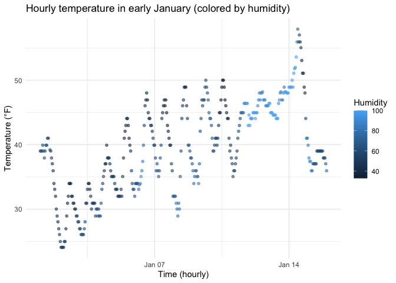

P8105 HW1
================
Yutong Mao (UNI: ym3139)
2025-09-20

# Problem 1

``` r
library(moderndive)
library(ggplot2)

data("early_january_weather")  
wx <- early_january_weather
```

The dataset `early_january_weather` has 358 rows and 15 columns.  
Important variables include: origin, year, month, day, hour, temp, dewp,
humid, wind_dir, wind_speed, wind_gust, precip, pressure, visib,
time_hour.  
The average temperature is 39.58 °F.

``` r
p_temp_time <- ggplot(wx, aes(x = time_hour, y = temp, color = humid)) +
  geom_point(alpha = 0.6, size = 1.3) +
  labs(
    x = "Time (hourly)",
    y = "Temperature (°F)",
    color = "Humidity",
    title = "Hourly temperature in early January (colored by humidity)"
  ) +
  theme_minimal()

p_temp_time
```

<!-- -->

The figure shows: Temperature fluctuates significantly throughout the
day (higher during the day, lower at night); and the color indicates a
trend of inverse correlation between humidity and temperature (periods
of lower temperature are often accompanied by higher humidity).

``` r
ggplot2::ggsave(
  filename = "fig_temp_vs_time.png",
  plot = p_temp_time,
  width = 7, height = 4, dpi = 300
)
```
