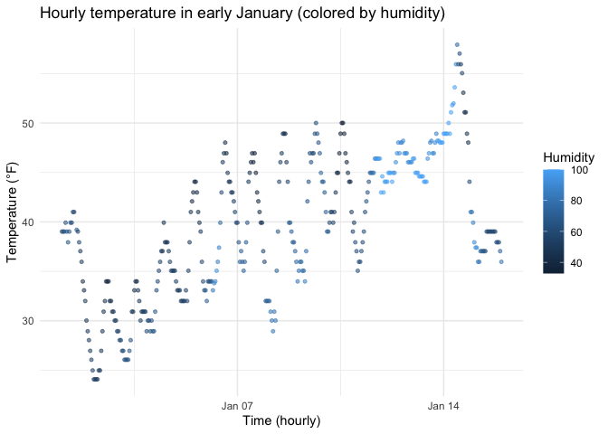

P8105 HW1
================
Yutong Mao (UNI: ym3139)
2025-09-20

# Problem 1

``` r
library(moderndive)
library(ggplot2)

data("early_january_weather")  
wx <- early_january_weather
```

The dataset `early_january_weather` has 358 rows and 15 columns.  
Important variables include: origin, year, month, day, hour, temp, dewp,
humid, wind_dir, wind_speed, wind_gust, precip, pressure, visib,
time_hour.  
The average temperature is 39.58 °F.

``` r
p_temp_time <- ggplot(wx, aes(x = time_hour, y = temp, color = humid)) +
  geom_point(alpha = 0.55, size = 1.1) +
  labs(
    x = "Time (hourly)",
    y = "Temperature (°F)",
    color = "Humidity",
    title = "Hourly temperature in early January (colored by humidity)"
  ) +
  theme_minimal()

p_temp_time
```

<!-- -->

The figure shows: Temperature fluctuates significantly throughout the
day (higher during the day, lower at night); and the color indicates a
trend of inverse correlation between humidity and temperature (periods
of lower temperature are often accompanied by higher humidity).

``` r
ggplot2::ggsave(
  filename = "fig_temp_vs_time.png",
  plot = p_temp_time,
  width = 7, height = 4, dpi = 300
)
```

# Problem 2

``` r
library(tidyverse)
set.seed(8105)

df_p2 <- tibble(
  norm_samp   = rnorm(10),                     # numeric
  is_positive = norm_samp > 0,                 # logical
  char_vec    = paste0("id_", 1:10),           # character
  factor_vec  = factor(                        # factor (3 levels)
    rep(c("low","med","high"), length.out = 10),
    levels = c("low","med","high")
  )
)

df_p2
```

    ## # A tibble: 10 × 4
    ##    norm_samp is_positive char_vec factor_vec
    ##        <dbl> <lgl>       <chr>    <fct>     
    ##  1    0.674  TRUE        id_1     low       
    ##  2    1.31   TRUE        id_2     med       
    ##  3    0.115  TRUE        id_3     high      
    ##  4    1.07   TRUE        id_4     low       
    ##  5    0.155  TRUE        id_5     med       
    ##  6    2.12   TRUE        id_6     high      
    ##  7   -0.219  FALSE       id_7     low       
    ##  8   -0.113  FALSE       id_8     med       
    ##  9   -0.0651 FALSE       id_9     high      
    ## 10    0.476  TRUE        id_10    low

``` r
mean_num   <- df_p2 %>% pull(norm_samp)   %>% mean()
mean_logi  <- df_p2 %>% pull(is_positive) %>% mean()

tibble(
  variable = c("norm_samp (numeric)", "is_positive (logical)"),
  mean     = c(mean_num,               mean_logi)
)
```

    ## # A tibble: 2 × 2
    ##   variable               mean
    ##   <chr>                 <dbl>
    ## 1 norm_samp (numeric)   0.552
    ## 2 is_positive (logical) 0.7

``` r
# These fail because the columns are not numeric/logical:
df_p2 %>% pull(char_vec)   %>% mean()
```

    ## Warning in mean.default(.): argument is not numeric or logical: returning NA

    ## [1] NA

``` r
df_p2 %>% pull(factor_vec) %>% mean()
```

    ## Warning in mean.default(.): argument is not numeric or logical: returning NA

    ## [1] NA

``` r
# Coercion demos (code only; output hidden)
as.numeric(df_p2$is_positive)     
```

    ##  [1] 1 1 1 1 1 1 0 0 0 1

``` r
as.numeric(df_p2$char_vec) 
```

    ## Warning: NAs introduced by coercion

    ##  [1] NA NA NA NA NA NA NA NA NA NA

``` r
as.numeric(df_p2$factor_vec) 
```

    ##  [1] 1 2 3 1 2 3 1 2 3 1

For numeric columns, the `mean()` function operates as expected.

For logical columns, `mean()` is also valid because `TRUE` is coerced to
1 and `FALSE` is coerced to 0, so the mean equals the proportion of
`TRUE` values.

For character and factor columns, `mean()` cannot be applied because
they are neither numeric nor logical.

Use `as.numeric()` to convert: - Logical → 0/1 (thus `mean()` calculates
as a proportion), - Character → `NA` (non-numeric strings cannot be
coerced), - Factor → the internal integer encoding of the levels (1, 2,
3), **not** the label values.

This explains why logical can compute the mean while character/factor
cannot.
